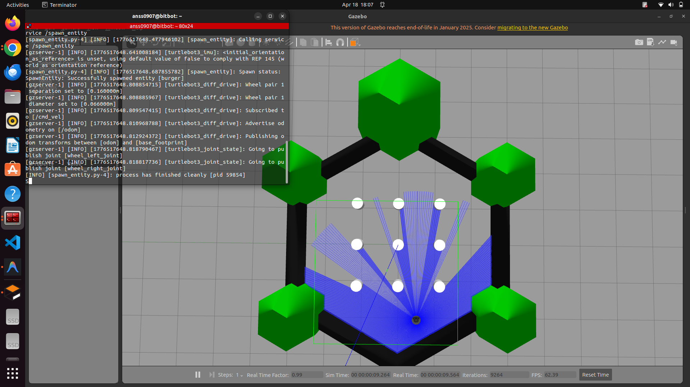
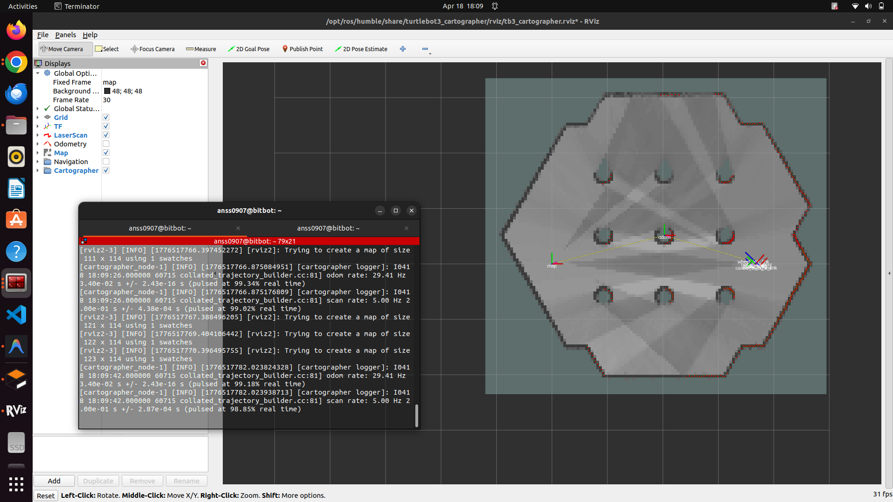
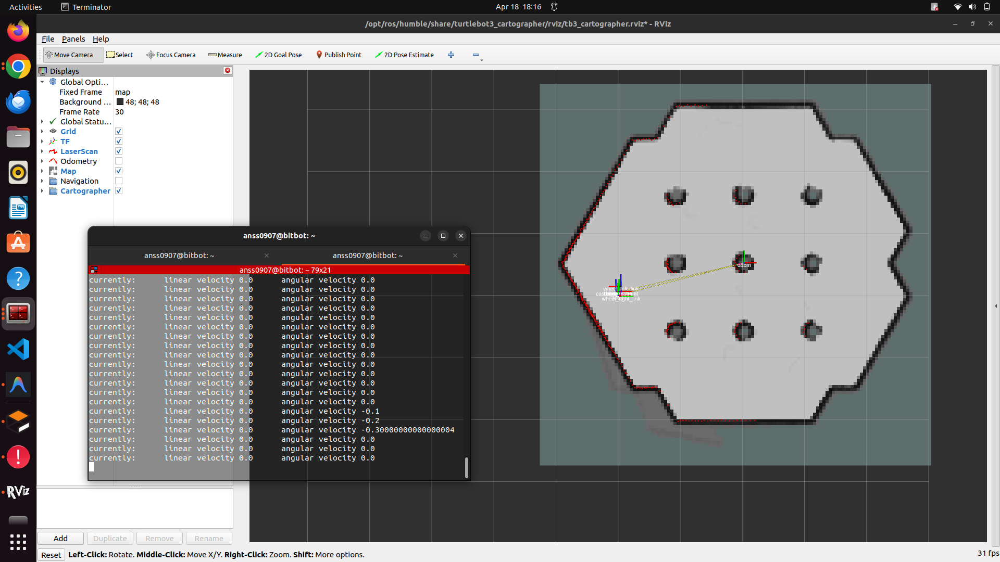
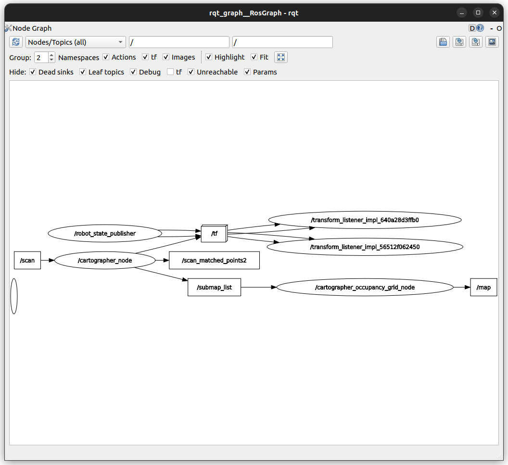
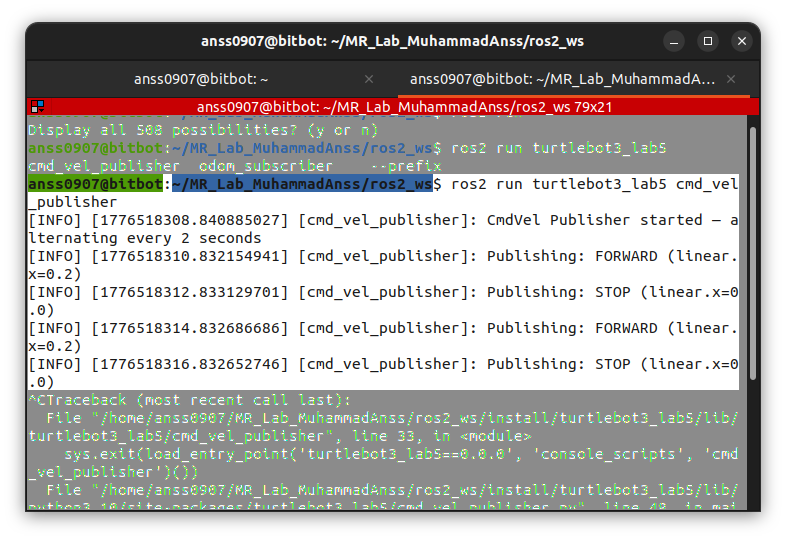

# Lab 5 Report: Gazebo & RViz with TurtleBot3

**Course:** MCT-454L Mobile Robotics
**Student:** Muhammad Anss
**Date:** April 18, 2026

---

## Getting Started

The first thing I did was install the TurtleBot3 and Gazebo packages using `sudo apt install ros-humble-turtlebot3* ros-humble-gazebo-ros-pkgs`. I ran into a 404 error because the ROS package mirror was out of sync — I had to clear the cached apt lists and re-run `apt update` to get fresh package URLs. After that, everything installed fine.

I also set the TurtleBot3 model to burger in my `~/.bashrc` so I wouldn't have to export it every time:

```bash
export TURTLEBOT3_MODEL=burger
```

---

## Launching Gazebo

I launched Gazebo with the TurtleBot3 world using:

```bash
ros2 launch turtlebot3_gazebo turtlebot3_world.launch.py
```

The first launch took a while because Gazebo had to download its 3D model assets, and the spawn service actually timed out initially. On the second attempt it loaded properly since the models were cached.



---

## SLAM with Cartographer & RViz

I opened a second terminal and launched Cartographer to start building a map while visualizing everything in RViz:

```bash
ros2 launch turtlebot3_cartographer cartographer.launch.py use_sim_time:=true
```

RViz opened up and I could see the robot model, the LiDAR scan points, and the map slowly being built as I drove the robot around.



---

## Configuring RViz Plugins

In RViz, I clicked **Add** and enabled the following visualization plugins:

- **LaserScan** — Showed the LiDAR scan points in real time
- **TF** — Displayed all coordinate frames and their relationships
- **Map** — Showed the SLAM-generated occupancy grid
- **Odometry** — Arrows showing robot's velocity and direction
- **Path** — Showed the path the robot has taken

I set the **Fixed Frame** to `map` so everything aligned properly.

### TF Frames Observed

The TF tree showed these frame relationships:

```
map → odom → base_footprint → base_link → base_scan
                                         → imu_link
                                         → wheel_left_link
                                         → wheel_right_link
                                         → caster_back_link
```

The `map → odom` transform comes from Cartographer (SLAM correction), while `odom → base_footprint` comes from wheel odometry.

---

## Teleoperation

I controlled the robot using keyboard teleop in a third terminal:

```bash
ros2 run turtlebot3_teleop teleop_keyboard
```

I drove the robot around the entire simulated world to build a complete map, using `w/a/d/s` for movement and `q/z` to adjust speed.

---

## Recording ros2 Bag

While teleoperating, I recorded all topics:

```bash
ros2 bag record -a
```

The bag file was saved to `rosbag2_2026_04_18-11_46_34/`. To replay just the velocity commands later:

```bash
ros2 bag play rosbag2_2026_04_18-11_46_34 --topics /cmd_vel
```

---

## Saving the Map

After exploring the full environment, I saved the generated map:

```bash
mkdir -p ~/maps
ros2 run nav2_map_server map_saver_cli -f maps/my_map
```

This generated `my_map.pgm` (the occupancy grid image) and `my_map.yaml` (metadata).

---

## Teleoping Back to Origin

I then tried to drive the robot back to (0, 0, 0) using teleop. It wasn't perfectly precise — the odometry drifted a bit — but I got reasonably close by monitoring the `/odom` topic.



---

## rqt_graph

I captured the node/topic graph to see how everything was connected:

```bash
rqt_graph
```



---

## Task 8: cmd_vel Publisher Node

I created a new ROS 2 package called `turtlebot3_lab5` and wrote a publisher node that alternates between publishing forward velocity (0.2 m/s) and zero velocity every 2 seconds.

The node uses a timer callback with a 2-second period and a toggle flag to switch between moving and stopping. Message type used is `geometry_msgs/msg/Twist`.

```bash
ros2 run turtlebot3_lab5 cmd_vel_publisher
```

The robot moved forward for 2 seconds, stopped for 2 seconds, and kept repeating. I could see it in Gazebo — it was kind of like watching the robot do a "walk-stop-walk" pattern.



---

## Task 9: Odom Subscriber Node

For the subscriber, I first identified the message type on `/odom`:

```bash
ros2 topic info /odom
# Type: nav_msgs/msg/Odometry
```

Then I wrote a subscriber node that prints position, orientation (quaternion), linear velocity, and angular velocity from each message received.

```bash
ros2 run turtlebot3_lab5 odom_subscriber
```

Sample output:

```
[INFO] [odom_subscriber]: Position    -> x: 1.6689, y: -0.5015, z: 0.0085
[INFO] [odom_subscriber]: Orientation -> x: -0.0019, y: 0.0022, z: 0.6278, w: 0.7784
[INFO] [odom_subscriber]: Linear Vel  -> x: -0.0004, y: -0.0000, z: 0.0000
[INFO] [odom_subscriber]: Angular Vel -> x: 0.0000, y: 0.0000, z: 0.1934
```

Full output is in `odom_subscriber_output.txt`.

---

*Code for both nodes is in `ros2_ws/src/turtlebot3_lab5/turtlebot3_lab5/`*
