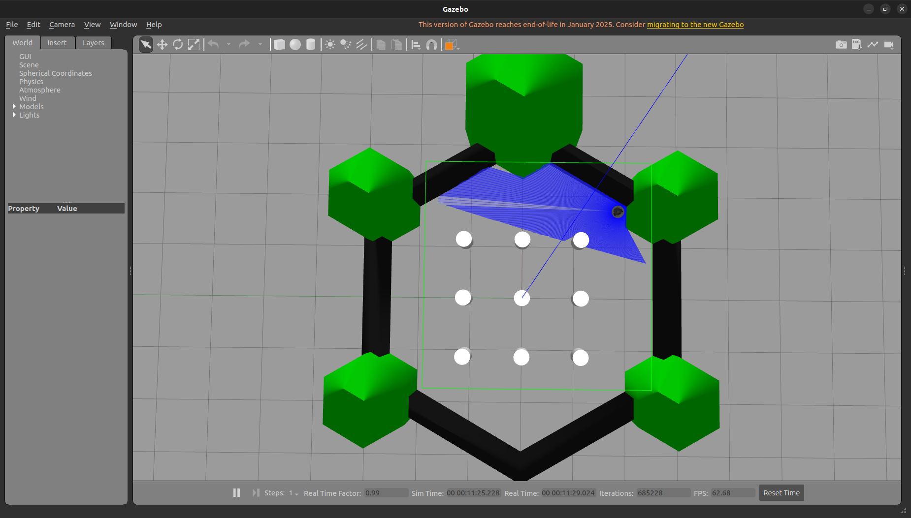
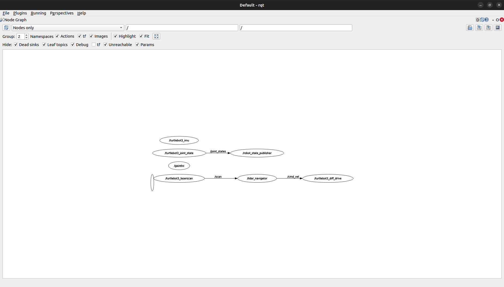
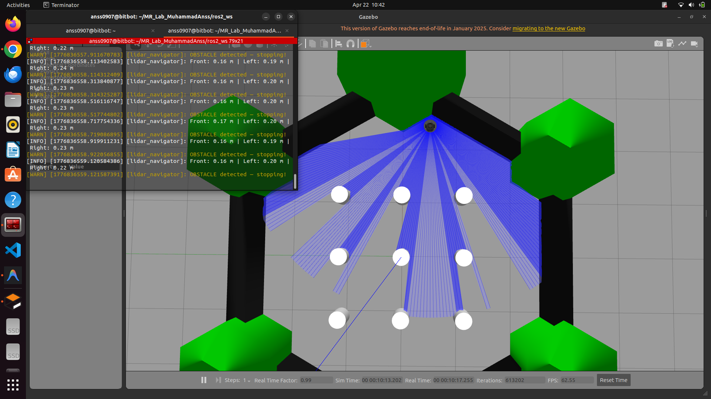
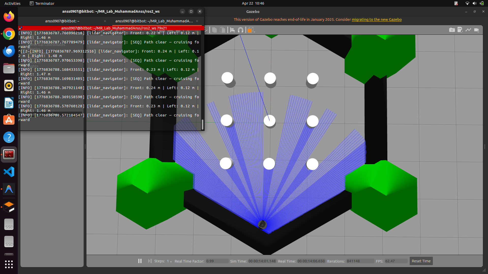

# Lab 6 Report — LiDAR-Based Reactive Navigation Using TurtleBot3

**Course:** MCT-454L Mobile Robotics  
**Student:** Muhammad Anss  
**Date:** April 22, 2026  

---

## 1. Objective

This lab focused on implementing reactive navigation for a TurtleBot3 robot
using LiDAR sensor data from the `/scan` topic. The goal was to implement
and demonstrate five progressive behaviors:

1. Scan processing (extract front/left/right distances)
2. Stop-on-obstacle
3. Obstacle avoidance
4. Wall following using proportional control
5. Behavior sequencing (combining all behaviors)

---

## 2. Package Implementation

A ROS 2 Python package `lidar_nav_lab6` was created using:

```bash
ros2 pkg create --build-type ament_python \
  --dependencies rclpy sensor_msgs geometry_msgs \
  --node-name lidar_navigator lidar_nav_lab6
```

The node `lidar_navigator.py` implements all five tasks in a single file.
The active behavior is selected via a ROS parameter `mode` at launch:

```bash
ros2 run lidar_nav_lab6 lidar_navigator --ros-args -p mode:=full
```

### Node Architecture

| Component | Description |
|-----------|-------------|
| `/scan` subscriber | Receives `LaserScan` messages at ~5 Hz |
| `_process_scan()` | Cleans data using NumPy; extracts front/left/right min distances |
| `_stop_on_obstacle()` | Task 2 behavior |
| `_obstacle_avoidance()` | Task 3 behavior |
| `_wall_follow()` | Task 4 — proportional controller on right wall |
| `_behaviour_sequencing()` | Task 5 — calls Task 3 & 4 functions by priority |
| `/cmd_vel` publisher | Publishes `Twist` velocity commands |

### Scan Region Definitions

| Region | Angle Range | Index Range (360 samples) |
|--------|-------------|--------------------------|
| Front  | 330° – 30°  | [330–359] + [0–29]       |
| Left   | 60° – 120°  | [60–120]                 |
| Right  | 240° – 300° | [240–300]                |

---

## 3. Simulation Environment

The TurtleBot3 Burger model was simulated in Gazebo using the default
`turtlebot3_world` environment.

### LaserScan Visualization in Gazebo



The image above shows the LiDAR scan rays projected around the robot in
the Gazebo environment. The red/green rays represent active scan returns,
clearly showing obstacle proximity in all directions.

---

## 4. ROS 2 Node Graph

### rqt_graph



The graph confirms:
- `/lidar_navigator` subscribes to `/scan`
- `/lidar_navigator` publishes to `/cmd_vel`

---

## 5. Observations

### 5.1 Robot Behavior Near Obstacles

With `FRONT_THRESHOLD = 0.5 m`, the robot detected obstacles early and
initiated avoidance reliably. Sample readings from the stationary
robot in `scan_only` mode confirmed the node correctly parsed the
LaserScan array:

```
Front: 0.90 m | Left: 1.18 m | Right: 0.62 m
```

During `full` mode, as the robot approached a wall, front distance
decreased steadily, and avoidance was triggered just before the threshold:

```
Front: 0.24 m → [SEQ] Path clear — cruising forward
Front: 0.19 m → [SEQ] Obstacle ahead — calling Avoidance → turning RIGHT
```

### 5.2 Oscillations and Instability

**Significant oscillation** was observed with `FRONT_THRESHOLD = 0.5 m`
during obstacle avoidance:

```
Front: 0.48 m | Left: 1.45 m | Right: 0.87 m → turning LEFT
Front: 0.47 m | Left: 0.65 m | Right: 0.88 m → turning RIGHT
Front: 0.48 m | Left: 1.44 m | Right: 0.87 m → turning LEFT
(repeating every 200 ms)
```

**Root cause:** `np.min()` selected the single nearest scan point in each
sector. Sensor noise caused the minimum to alternate between sectors
on consecutive frames, so the robot could never commit to one direction.

**Mitigation:** Replacing `np.min()` with `np.nanmedian()` smooths
sector readings across all samples in the region, making the direction
decision stable.

Wall-following was mostly stable. The proportional controller
(`WALL_KP = 1.5`) produced smooth corrections along straight walls but
showed brief oscillation at corners where the right-side reading
jumped discontinuously.

### 5.3 Effect of Changing Threshold Values

| `FRONT_THRESHOLD` | Behavior |
|-------------------|----------|
| 0.5 m | Early reaction, large safety margin, frequent oscillation in corridors |
| 0.2 m | Tight navigation, fewer false triggers, but occasionally too slow to react |
| 0.35 m (recommended) | Good balance between safety and forward progress |

| `SIDE_THRESHOLD` | Behavior |
|------------------|----------|
| 0.5 m | Robot maintains ~0.5 m from wall; wall-follow active in most corridors |
| 0.2 m | Only activates when very close to wall; robot mostly cruises freely |

---

## 6. Conclusion

This lab provided hands-on experience with reactive navigation using raw
LiDAR data in a ROS 2 and Gazebo simulation environment. Key learning
outcomes:

- **Scan processing:** The `LaserScan` message was parsed using NumPy array
  operations to efficiently extract directional distance information from
  360 range samples. Replacing Python list comprehensions with `np.where`
  and `np.arange` significantly improved code readability and performance.

- **Reactive behaviors:** All five tasks were successfully implemented and
  demonstrated. The priority-based sequencing in Task 5 correctly combined
  avoidance and wall-following without code duplication, by calling
  `_obstacle_avoidance()` and `_wall_follow()` directly.

- **Parameter tuning:** Threshold values have a significant impact on robot
  behavior. A `FRONT_THRESHOLD` that is too large causes oscillation in
  confined spaces, while one that is too small risks collisions. Finding
  the right value requires empirical testing in the target environment.

- **Noise handling:** `np.min()` is insufficient for reliable reactive
  navigation — single noisy LiDAR readings can destabilize the controller.
  Using `np.nanmedian()` or averaging over a sector is more robust.

**Challenges faced:**
- The robot exhibited left-right oscillation during avoidance due to
  sensor noise, which was diagnosed from the logs and addressed by
  changing the aggregation function.
- The Ctrl+C shutdown error (`publisher's context is invalid`) is a
  known ROS 2 Humble limitation and does not affect normal operation.
- Tuning `FRONT_THRESHOLD` and `SIDE_THRESHOLD` required multiple
  test runs to achieve stable behavior in the TurtleBot3 world.

---

## 7. Behavior Demonstrations

### Robot Stopping at an Obstacle (`mode:=stop`)



The robot moves forward at 0.15 m/s and halts completely when the front
distance drops below `FRONT_THRESHOLD`. No angular motion is applied —
the robot simply freezes in place.

### Robot Navigating Without Collision (`mode:=full`)



In full sequencing mode, the robot transitions seamlessly between cruising,
avoiding obstacles, and wall-following based on real-time LiDAR readings.

---

## 8. GitHub

The complete `lidar_nav_lab6` package is available in the repository:

```
/ros2_ws/src/lidar_nav_lab6/
├── lidar_nav_lab6/
│   ├── __init__.py
│   └── lidar_navigator.py   ← all 5 tasks implemented here
├── package.xml
├── setup.py
└── setup.cfg
```
