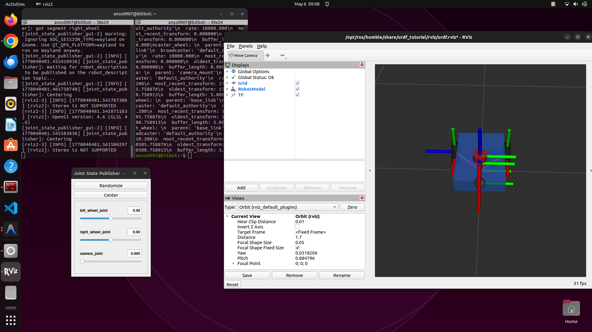

# Lab 8 Report: Building and Visualizing a Custom Mobile Robot using URDF

**Student:** Muhammad Anss  
**Registration:** 2022-MC-01  
**Date:** 2026-05-06

---

## Objective

Design a custom differential drive mobile robot using URDF and visualize it in RViz using ROS 2 Humble.

---

## Package Structure

```
lab8_URDF/
├── lab8_URDF/
├── urdf/
│   ├── my_robot.urdf         # Guided tutorial URDF
│   └── StudentTask.urdf      # Custom robot URDF
├── launch/
├── rviz/
├── setup.py
└── package.xml
```

---

## Task 1–3: Guided Tutorial

Followed the lab manual to create `my_robot.urdf` with:
- A `base_link` (box) and a `camera` (cylinder) connected by a **fixed** joint.
- Launched using: `ros2 launch urdf_tutorial display.launch.py model:=<path>/my_robot.urdf`
- Verified TF tree using: `ros2 run tf2_tools view_frames`

---

## Student Task: Custom Robot Design (`StudentTask.urdf`)

### Robot Overview

A differential drive mobile robot named `my_custom_robot` with 6 links and 5 joints.

### Links & Geometries

| # | Link | Geometry | Dimensions | Material |
|---|------|----------|------------|----------|
| 1 | `base_link` | Box | 0.4 × 0.3 × 0.1 m | Blue |
| 2 | `left_wheel` | Cylinder | r=0.07, l=0.04 m | Black |
| 3 | `right_wheel` | Cylinder | r=0.07, l=0.04 m | Black |
| 4 | `caster_wheel` | Sphere | r=0.035 m | Dark Grey |
| 5 | `camera_mount` | Cylinder (pole) | r=0.015, l=0.08 m | Dark Grey |
| 6 | `camera` | Cylinder | r=0.04, l=0.04 m | Red |

### Joints

| # | Joint | Type | Parent → Child | Notes |
|---|-------|------|----------------|-------|
| 1 | `left_wheel_joint` | **Continuous** | base_link → left_wheel | Rotates freely around Y-axis (via rpy) |
| 2 | `right_wheel_joint` | **Continuous** | base_link → right_wheel | Rotates freely around Y-axis (via rpy) |
| 3 | `caster_wheel_joint` | **Fixed** | base_link → caster_wheel | Passive support at front |
| 4 | `camera_mount_joint` | **Fixed** | base_link → camera_mount | Vertical pole on top |
| 5 | `camera_joint` | **Revolute** | camera_mount → camera | 0° to 360° (0 to 6.2832 rad) |

### Customizations Summary

1. **Differential Drive:** Two rear wheels with `continuous` joints allowing unlimited rotation, enabling differential drive locomotion.
2. **Caster Wheel:** A front passive sphere (`fixed` joint) for three-point stability.
3. **Camera Mount Pole:** A thin cylindrical pole rising from the base to elevate the camera.
4. **Revolute Camera:** A cylindrical camera on top with a `revolute` joint allowing full 360° panning, controllable via the Joint State Publisher GUI slider.
5. **Defined Materials:** All colors (`blue`, `black`, `dark_grey`, `red`) are properly defined with RGBA values to eliminate material warnings.
6. **Three Joint Types Used:** `continuous`, `fixed`, and `revolute` — as required by the lab manual.

---

## Commands Used

```bash
# Package creation
cd ~/MR_Lab_MuhammadAnss/ros2_ws/src && ros2 pkg create lab8_URDF --build-type ament_python && mkdir -p lab8_URDF/urdf lab8_URDF/launch lab8_URDF/rviz

# Visualize in RViz
ros2 launch urdf_tutorial display.launch.py model:=/home/anss0907/MR_Lab_MuhammadAnss/ros2_ws/src/lab8_URDF/urdf/StudentTask.urdf

# View TF tree
ros2 run tf2_tools view_frames
```

---

## RViz Visualization



---

## Deliverables

- [x] Custom robot URDF file (`StudentTask.urdf`)
- [x] Screenshot of robot in RViz
- [x] Summary of customizations *(this report)*
- [x] Optional: RViz configuration file (`StudentTask.rviz`)
