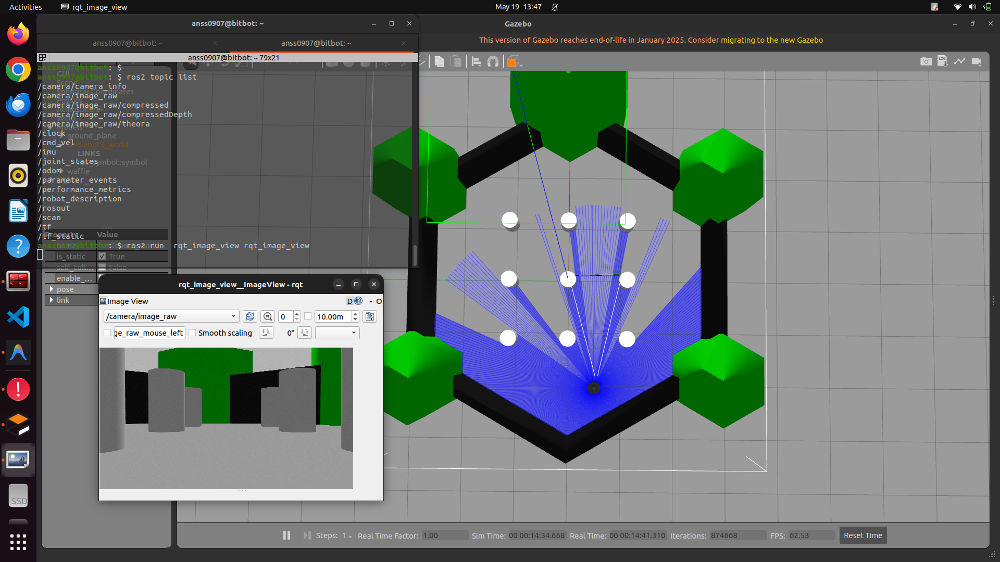
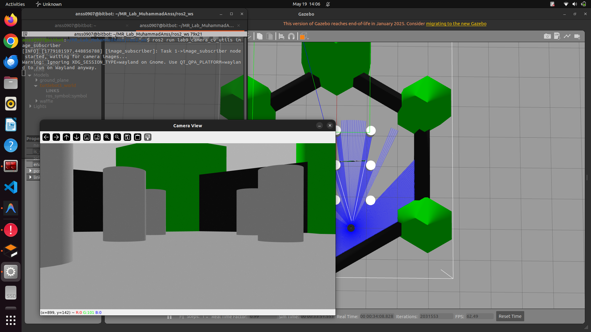
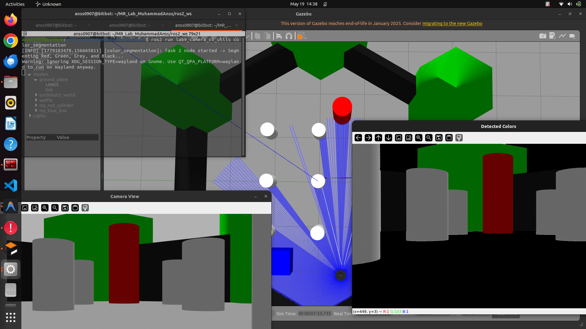
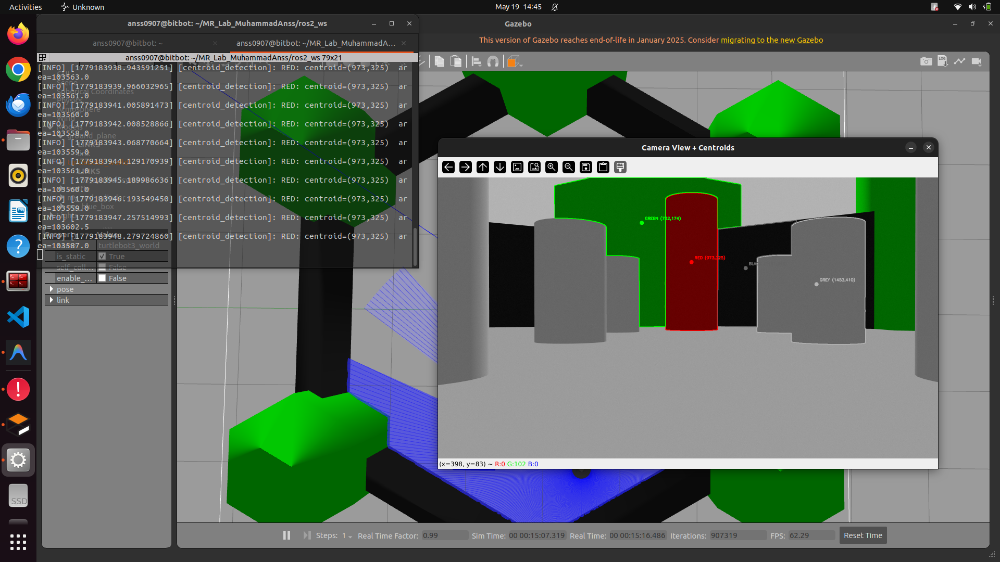
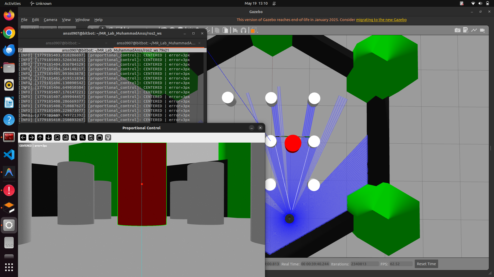
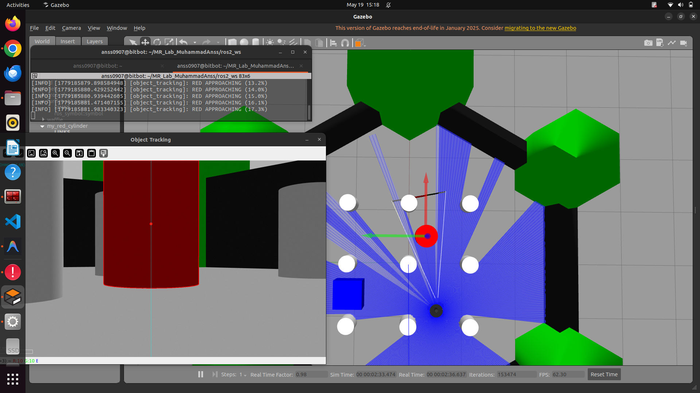
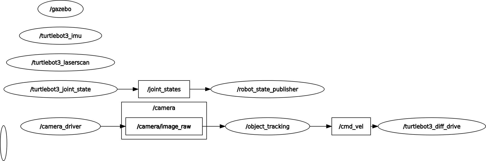

# Lab 9: Vision-Based Target Tracking Using Camera

| | |
|---|---|
| **Student** | Muhammad Anss |
| **Registration** | 2022-MC-01 |
| **Date** | May 20, 2026 |
| **Course** | MCT-454L Mobile Robotics |
| **Submitted to** | Dr Maria |
| **Platform** | TurtleBot3 Waffle (Gazebo Simulation) |

---

## 1. Lab Objective

The objective of this lab was to implement a complete **vision-based perception and control pipeline** using the TurtleBot3 Waffle's onboard camera in Gazebo simulation. The lab required subscribing to the `/camera/image_raw` topic, performing color-based object detection using OpenCV, computing object centroids, and generating closed-loop motion commands to align with and approach detected targets.

---

## 2. Pre-Lab Setup

The simulation was launched using the standard TurtleBot3 Waffle configuration:

```bash
export TURTLEBOT3_MODEL=waffle
ros2 launch turtlebot3_gazebo turtlebot3_world.launch.py
```

Camera topic availability was verified using `ros2 topic list` and the live camera stream was inspected using `rqt_image_view`:

```bash
ros2 run rqt_image_view rqt_image_view
```



Custom colored objects (red cylinders, blue boxes) were spawned into the Gazebo world using `ros2 run gazebo_ros spawn_entity.py` with inline SDF models passed via `-stdin`. The following commands were used:

**Spawning a Red Cylinder** at position (1.5, -0.5, 0.5):
```bash
ros2 run gazebo_ros spawn_entity.py -entity my_red_cylinder -x 1.5 -y -0.5 -z 0.5 -stdin <<EOF
<?xml version="1.0" ?>
<sdf version="1.6">
  <model name="my_red_cylinder2">
    <static>true</static>
    <link name="link">
      <collision name="collision">
        <geometry><cylinder><radius>0.2</radius><length>1.0</length></cylinder></geometry>
      </collision>
      <visual name="visual">
        <geometry><cylinder><radius>0.2</radius><length>1.0</length></cylinder></geometry>
        <material>
          <ambient>1 0 0 1</ambient>
          <diffuse>1 0 0 1</diffuse>
        </material>
      </visual>
    </link>
  </model>
</sdf>
EOF
```

**Spawning a Blue Box** at position (1.5, 1.0, 0.5):
```bash
ros2 run gazebo_ros spawn_entity.py -entity my_blue_box -x 1.5 -y 1.0 -z 0.5 -stdin <<EOF
<?xml version="1.0" ?>
<sdf version="1.6">
  <model name="my_blue_box">
    <static>true</static>
    <link name="link">
      <collision name="collision">
        <geometry><box><size>0.5 0.5 0.5</size></box></geometry>
      </collision>
      <visual name="visual">
        <geometry><box><size>0.5 0.5 0.5</size></box></geometry>
        <material>
          <ambient>0 0 1 1</ambient>
          <diffuse>0 0 1 1</diffuse>
        </material>
      </visual>
    </link>
  </model>
</sdf>
EOF
```

The `<static>true</static>` tag ensures the objects remain fixed in place and are not affected by physics. The `<ambient>` and `<diffuse>` tags define the object color in RGBA format (values 0.0–1.0).

---

## 3. Package Structure

A custom ROS 2 Python package `lab9_camera_cv_utils` was created with `ament_python` build type. The package contains five nodes, one for each lab task:

```
lab9_camera_cv_utils/
├── package.xml
├── setup.py
├── resource/
│   └── lab9_camera_cv_utils
└── lab9_camera_cv_utils/
    ├── __init__.py
    ├── task1_image_subscriber.py        # Task 1: Camera subscription & display
    ├── task2_color_segmentation.py      # Task 2: HSV color segmentation
    ├── task3_centroid_detection.py       # Task 3: Per-color centroid computation
    ├── task4_proportional_control.py    # Task 4: Proportional angular control
    └── task5_object_tracking.py         # Task 5: Full object tracking with approach
```

**Dependencies:** `rclpy`, `sensor_msgs`, `geometry_msgs`, `cv_bridge`, `opencv-python`, `numpy`

---

## 4. Lab Tasks

### Task 1: Subscribe to Camera and Display Image

**Objective:** Subscribe to `/camera/image_raw` and display the live camera feed using OpenCV.

**Implementation (`task1_image_subscriber.py`):**
- Created a ROS 2 node `ImageSubscriber` that subscribes to `/camera/image_raw` with `sensor_msgs/Image`.
- Used `cv_bridge.CvBridge` to convert the ROS image message to an OpenCV BGR frame.
- Applied 50% downscaling (`cv2.resize`) to prevent the display window from covering the entire screen.
- Displayed using `cv2.imshow()`.

**Key Code:**
```python
def image_callback(self, msg):
    frame = self.bridge.imgmsg_to_cv2(msg, desired_encoding='bgr8')
    frame_small = cv2.resize(frame, (0, 0), fx=0.5, fy=0.5)
    cv2.imshow('Camera View', frame_small)
    cv2.waitKey(1)
```

**Run Command:**
```bash
ros2 run lab9_camera_cv_utils image_subscriber
```

**Result:**



---

### Task 2: HSV Color Segmentation

**Objective:** Convert the camera image to HSV color space and perform color segmentation to detect multiple colors.

**Implementation (`task2_color_segmentation.py`):**
- Converted the BGR frame to HSV using `cv2.cvtColor(frame, cv2.COLOR_BGR2HSV)`.
- Applied `cv2.GaussianBlur` before conversion to reduce pixel noise.
- Defined HSV threshold ranges for **Red**, **Green**, **Grey**, and **Black** colors.
- Created individual binary masks using `cv2.inRange()` for each color.
- Combined all masks using bitwise OR (`|`).
- Applied morphological operations (`MORPH_OPEN` and `MORPH_CLOSE`) with a 7×7 kernel to remove noise and fill gaps.
- Used `cv2.bitwise_and()` to isolate detected colors from the original frame.

**HSV Thresholds Used:**

| Color | Hue (H) | Saturation (S) | Value (V) |
|-------|---------|----------------|-----------|
| Red (range 1) | 0–10 | 150–255 | 70–255 |
| Red (range 2) | 160–180 | 150–255 | 70–255 |
| Green | 40–80 | 50–255 | 50–255 |
| Grey | 0–180 | 0–40 | 80–150 |
| Black | 0–180 | 0–255 | 0–30 |

> **Note:** Red wraps around the hue circle (0° and 180°), so two separate ranges were required and combined with `cv2.bitwise_or()`.

**Key Concepts:**
- **`cv2.morphologyEx(mask, cv2.MORPH_OPEN, kernel)`** — Erosion followed by dilation. Removes small noise blobs from the background.
- **`cv2.morphologyEx(mask, cv2.MORPH_CLOSE, kernel)`** — Dilation followed by erosion. Fills small holes and gaps inside detected regions.

**Run Command:**
```bash
ros2 run lab9_camera_cv_utils color_segmentation
```

**Result:**



---

### Task 3: Centroid Detection

**Objective:** Find contours in the segmented mask and compute the centroid of the largest detected object for each color.

**Implementation (`task3_centroid_detection.py`):**
- Each color (Red, Green, Blue, Grey, Black) is processed **independently** through a `process_color()` helper method.
- For each color mask, contours are found using `cv2.findContours()` with `RETR_EXTERNAL` mode.
- The largest contour is selected using `max(contours, key=cv2.contourArea)`.
- A minimum contour area threshold of 500 pixels filters out noise.
- The centroid is computed using **image moments** (`cv2.moments()`):

```python
M = cv2.moments(largest)
cx = int(M['m10'] / M['m00'])  # centroid X
cy = int(M['m01'] / M['m00'])  # centroid Y
```

- Each detected color gets its own contour outline, centroid dot, and label drawn in the matching color.

**What are Image Moments?**
Image moments are weighted averages of pixel intensities. The zeroth moment `m00` represents the total area. The first moments `m10` and `m01` represent the sum of x and y coordinates weighted by intensity. Dividing `m10/m00` and `m01/m00` gives the centroid (center of mass) of the contour.

**Run Command:**
```bash
ros2 run lab9_camera_cv_utils centroid_detection
```

**Result:**



---

### Task 4: Proportional Control for Alignment

**Objective:** Use the centroid's horizontal error to generate proportional angular velocity commands, steering the robot to center the detected object in the camera frame.

**Implementation (`task4_proportional_control.py`):**
- Tracks **RED objects only** to avoid interference from background colors.
- Computes the horizontal error: `error_x = centroid_x - image_center_x`
- Applies proportional control: `angular.z = -kp × error_x`
  - If the object is to the right (positive error), the robot turns clockwise (negative angular.z).
  - If the object is to the left (negative error), the robot turns counter-clockwise (positive angular.z).
- When no red object is detected, the robot continuously rotates at `0.3 rad/s` to search.
- Publishes `geometry_msgs/Twist` to `/cmd_vel`.

**Tuned Parameters:**

| Parameter | Value | Description |
|-----------|-------|-------------|
| `kp` | 0.0005 | Proportional gain — tuned to avoid oscillation |
| `center_threshold` | 3 px | Dead zone — object considered "centered" within this range |
| `search_speed` | 0.3 rad/s | Rotation speed when searching for the object |

**Observations on Tuning `kp`:**
- **Large `kp` (e.g., 0.005):** Robot oscillated aggressively around the target, overshooting left and right. The motion was unstable and jerky.
- **Very small `kp` (e.g., 0.0001):** Robot responded too sluggishly and took a long time to align. In some cases, it could not keep up with a moving target.
- **Optimal `kp` (0.0005):** Smooth, stable convergence to the target center with minimal overshoot. The robot aligned within 2–3 seconds.

**Visualization:** The node draws a yellow center line, a cyan error line from center to centroid, and status text showing the current state (SEARCHING / TURNING / CENTERED).

**Run Command:**
```bash
ros2 run lab9_camera_cv_utils proportional_control
```

**Result:**



---

### Task 5: Object Tracking (Approach and Stop)

**Objective:** Implement a complete object tracking behavior — search, align, approach, and stop at a safe distance.

**Implementation (`task5_object_tracking.py`):**
This is the most comprehensive node, combining all previous tasks into a full tracking pipeline.

**Features:**
1. **Multi-color priority detection (RED > BLUE > GREEN):** Colors are checked in priority order. The first detected color is tracked.
2. **Proportional angular control:** Same steering logic as Task 4.
3. **Forward approach:** When the object is centered (within `center_threshold`), the robot drives forward at `0.15 m/s`.
4. **Percentage-based stopping:** Instead of a fixed area threshold, the robot stops when the detected color fills **65%** of the camera frame. This is resolution-independent and intuitive.
5. **360° search with timeout:** When a tracked object disappears:
   - The robot rotates at `0.3 rad/s` for one full revolution (`2π / 0.3 ≈ 20.9 seconds`).
   - If the object is re-acquired during the search, tracking resumes immediately.
   - If nothing is found after 360°, the robot stops completely.
6. **Proximity progress bar:** A visual bar at the bottom of the frame shows how close the screen-fill percentage is to the stopping threshold.

**State Machine:**

| State | Condition | Action |
|-------|-----------|--------|
| Initial Search | No prior detection | Rotate indefinitely |
| Aligning | Object found, off-center | Steer only (no forward) |
| Approaching | Object centered | Drive forward at 0.15 m/s |
| Stopped | Screen fill ≥ 65% | Full stop (safe distance) |
| 360° Search | Object lost after detection | Rotate for ~21s |
| Search Exhausted | 360° done, nothing found | Full stop |

**Run Command:**
```bash
ros2 run lab9_camera_cv_utils object_tracking
```

**Result:**



---

## 5. ROS Graph

The `rqt_graph` below shows the active nodes and topics during Task 5 execution. The perception-to-control pipeline is clearly visible:

`/camera/image_raw` → `object_tracking` node → `/cmd_vel`



---

## 6. Demonstration Video

A full demonstration video of the robot performing object tracking in the Gazebo simulation is available:


The video demonstrates:
- Detection of a colored object in the Gazebo world
- Proportional alignment with the object's centroid
- Forward motion toward the object
- Smooth stopping at a safe distance

---

## 7. Observations on Controller Tuning and Color Segmentation

### Color Segmentation Observations

1. **HSV vs BGR:** Working in HSV color space proved significantly more robust than BGR for color detection. HSV separates chromaticity (Hue) from intensity (Value), making detection less sensitive to lighting changes in the simulation.

2. **Red detection challenge:** Red wraps around the hue axis (0° and 180°), requiring two `inRange()` calls. This is a common pitfall in HSV-based detection that must be explicitly handled.

3. **Noise from environment:** The Gazebo `turtlebot3_world` has surfaces with subtle color tints. Grey and black masks, in particular, would often pick up the floor and walls, producing false positives. This was mitigated by:
   - Applying `GaussianBlur` before HSV conversion.
   - Raising the saturation minimum for red to 150 (rejecting weakly-colored pixels).
   - Using a 7×7 morphological kernel for aggressive noise cleanup.

4. **Saturation is critical:** High-saturation thresholds effectively reject background noise. The floor in the simulation has low saturation, so requiring `S ≥ 150` for red eliminated nearly all false positives.

5. **Morphological operations order matters:** `MORPH_OPEN` (noise removal) should always precede `MORPH_CLOSE` (gap filling). Reversing the order can amplify noise before attempting to remove it.

### Controller Tuning Observations

1. **Proportional gain (`kp`):** The optimal value of `0.0005` was found experimentally. Higher values caused oscillation around the target, while lower values produced sluggish response. The sweet spot balances reactivity with stability.

2. **Center threshold (dead zone):** A 3-pixel dead zone prevents micro-oscillations when the object is nearly centered. Without it, the robot would constantly jitter due to sub-pixel noise in the centroid calculation.

3. **Screen-fill stopping criterion:** Using a percentage-based stopping threshold (`65%` of screen) proved more intuitive and resolution-independent than a fixed pixel-area threshold. As the robot approaches, the object naturally fills more of the camera frame.

4. **Search behavior:** The 360° timeout search prevents the robot from spinning indefinitely when the object is removed. The time-based approach (`2π / angular_speed`) is simple and effective without requiring odometry data.

---

## 8. Perception-to-Control Pipeline

The complete pipeline implemented in this lab follows this architecture:

```
/camera/image_raw → CvBridge → GaussianBlur → BGR→HSV → inRange (masks)
    → Morphological Cleanup → findContours → moments (centroid)
    → Error Computation → Proportional Control → /cmd_vel
```

This demonstrates how **raw sensor data** (camera image) is progressively transformed through **perception** (color detection, segmentation), **feature extraction** (centroid computation), **error computation** (horizontal pixel offset), and finally **control** (proportional angular/linear velocity) — forming a complete closed-loop robotic system.

---

## 9. Conclusion

This lab provided comprehensive hands-on experience in implementing a **vision-based perception and control system** using ROS 2 and OpenCV. The key learning outcomes achieved are:

1. **Image Data Processing in ROS 2:** Successfully subscribed to and processed real-time image data from the `/camera/image_raw` topic using `cv_bridge` for ROS-to-OpenCV conversion. Understood the role of message types (`sensor_msgs/Image`) and quality-of-service settings in image transport.

2. **Feature Extraction with OpenCV:** Implemented a multi-stage image processing pipeline — from color space conversion (BGR → HSV), thresholding (`inRange`), morphological filtering (`MORPH_OPEN`, `MORPH_CLOSE`), contour detection (`findContours`), to centroid computation (`moments`). Gained practical understanding of how each stage contributes to robust object detection.

3. **Control from Visual Input:** Translated visual perception into real-time robot motion using proportional control. Understood the relationship between pixel-space error and angular velocity, and how tuning the proportional gain `kp` directly affects system stability, response time, and overshoot.

4. **Vision-Based Navigation Behavior:** Built a complete autonomous behavior (search → align → approach → stop) that operates entirely from camera input without relying on LIDAR or odometry. This demonstrated how perception, decision-making, and motion control integrate in mobile robotic systems.

5. **Practical Engineering Skills:** Gained experience in parameter tuning, noise mitigation, state machine design, and debugging real-time visual systems — skills directly applicable to real-world robotics applications such as autonomous navigation, warehouse robots, and service robots.

The lab successfully demonstrated that a mobile robot can achieve purposeful, goal-directed behavior using only a camera and basic image processing techniques, forming the foundation for more advanced vision-based autonomy.

---

## 10. Deliverables Checklist

| # | Deliverable | Status |
|---|-------------|--------|
| 1 | ROS 2 package pushed to GitHub | ✅ |
| 2 | Source code for vision-based control nodes | ✅ |
| 3 | Screenshots of camera view and segmented mask | ✅ |
| 4 | rqt_graph showing active nodes and topics | ✅ |
| 5 | Demonstration video of robot behavior | ✅ |
| 6 | Observations on controller tuning and color segmentation | ✅ |
| 7 | Brief conclusion summarizing learning outcomes | ✅ |
